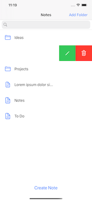
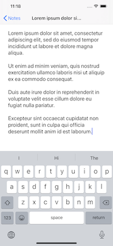
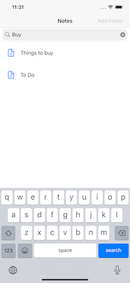

## Notes and Folders

### With this little app, you can easily create and organize your notes. Create as many folders and subfolders as you like.

Enjoy simple and clean design. 

To add items, just tap the button. To edit or delete, use swipe gestures.

&nbsp;&nbsp;&nbsp;&nbsp;

All your folders will be sorted in alphabetical order. Notes instead will be organized by the modification date. 

Search for your notes right on the spot. App searches for all notes within the current folder and all subfolders. 

Clean the search bar to exit the search.
 
### Key features:
 - Coordinator pattern implemented
 - Create as many folders and subfolders as you like
 - Tap on a folder to enter
 - Tap on a note to edit
 - Folders sort in alphabetical order
 - Notes sort by modification date
 - Note's name generated automatically from the first few words
 - For folders delete and edit name is available in a left-swipe gesture
 - Delete of a folder wipes out all it's containing items
 - For notes delete is available in a left-swipe gesture
 -  Search is recursive and case insensitive

### Todos
 - Make Items movable
 - Add Tags 
 - Add Dark Theme

